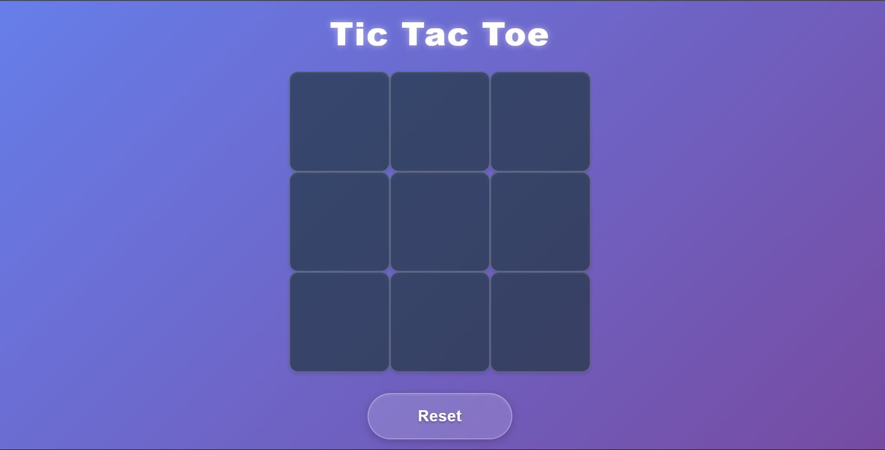

# 🎮 Tic Tac Toe - React App

A simple, fun, and responsive Tic Tac Toe game built using **React**!

## 🚀 Features

- Clean UI with modern styling
- Two-player mode
- Game reset functionality
- React functional components and hooks

- A clean and modern Tic Tac Toe game built using **React**. Play with a friend on the same device!  
Now live — no install needed. Just click and play! 🚀

🔗 **Live Demo:** [tic-tac-toe-game.vercel.app](https://tic-tac-toe-game-virid-gamma.vercel.app/)

---

## 🛠️ Tech Stack

- React
- HTML/CSS
- JavaScript

## 📸 Preview

### 🟦 Game Start

### 🟨 Win Screen

## 🧑‍💻 Getting Started

# React + Vite

This template provides a minimal setup to get React working in Vite with HMR and some ESLint rules.

Currently, two official plugins are available:

- [@vitejs/plugin-react](https://github.com/vitejs/vite-plugin-react/blob/main/packages/plugin-react/README.md) uses [Babel](https://babeljs.io/) for Fast Refresh
- [@vitejs/plugin-react-swc](https://github.com/vitejs/vite-plugin-react-swc) uses [SWC](https://swc.rs/) for Fast Refresh

## Expanding the ESLint configuration

If you are developing a production application, we recommend using TypeScript and enable type-aware lint rules. Check out the [TS template](https://github.com/vitejs/vite/tree/main/packages/create-vite/template-react-ts) to integrate TypeScript and [`typescript-eslint`](https://typescript-eslint.io) in your project.
